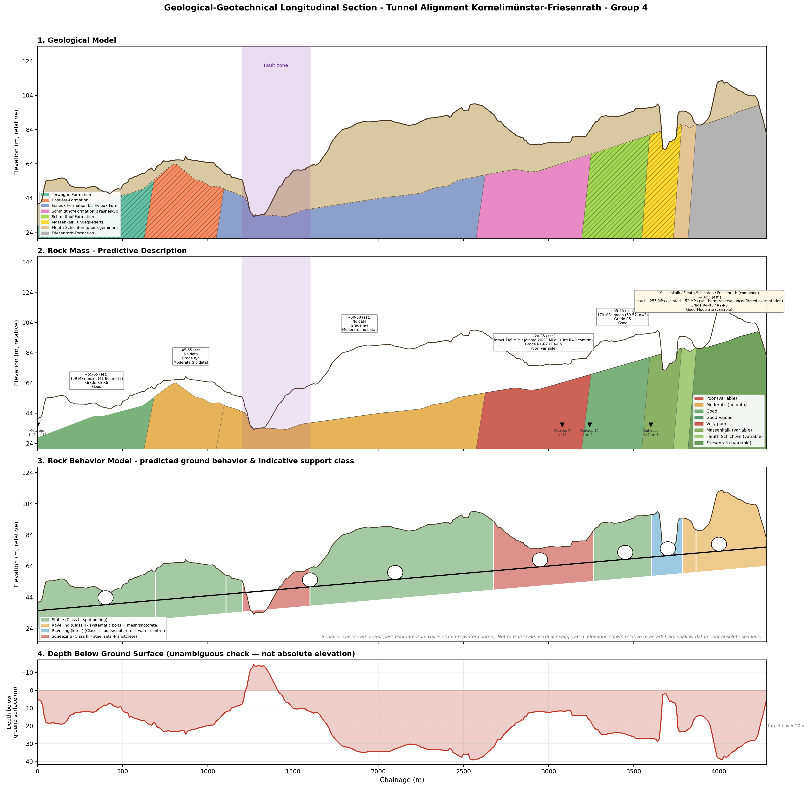
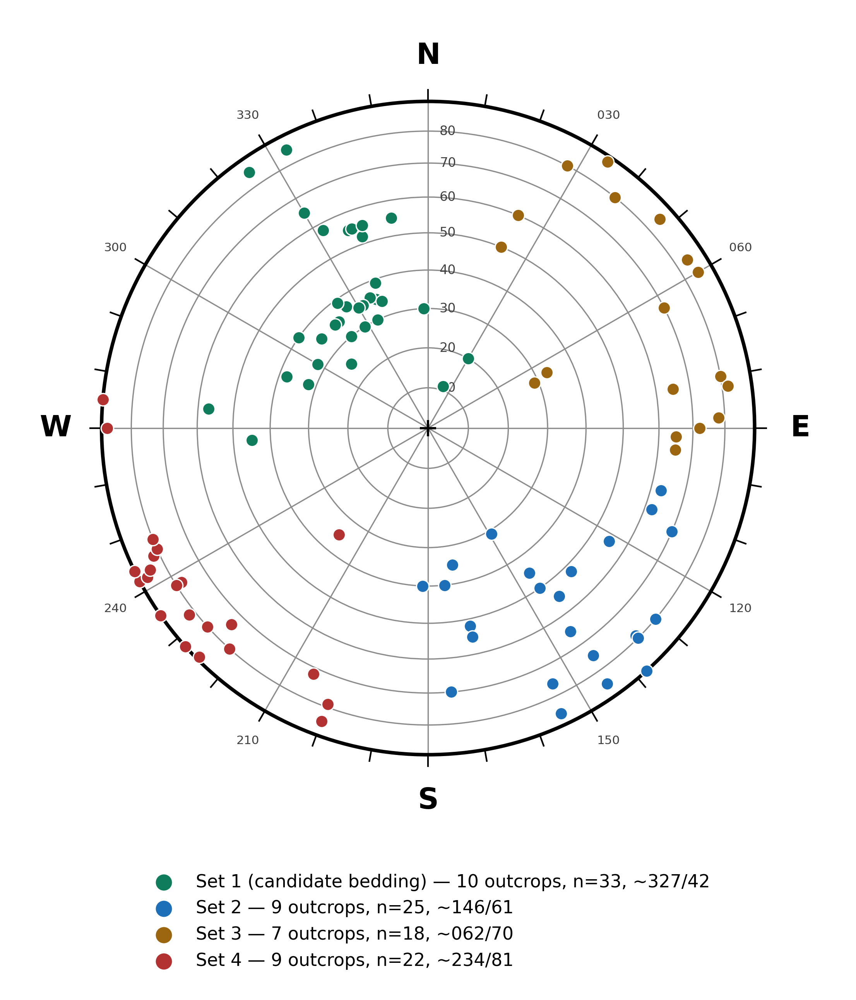
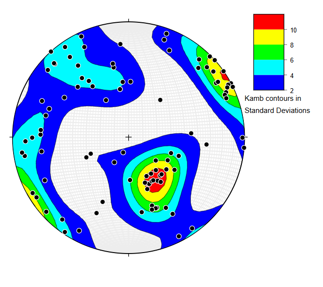
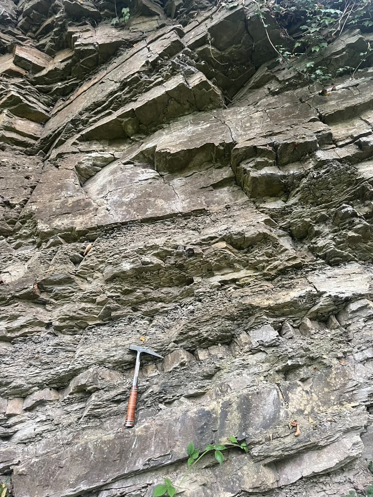
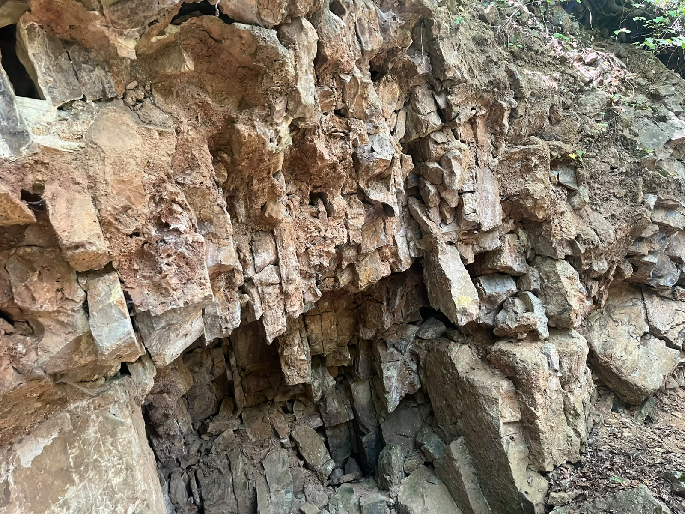
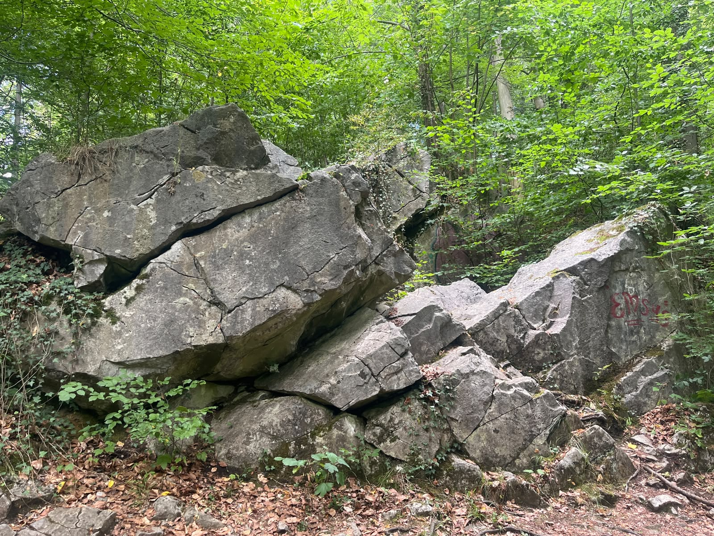

# Geological-Geotechnical Feasibility Study
## Tunnel Alignment: Kornelimünster → Walheim → Friesenrath
### Aachen Region, North Rhine-Westphalia, Germany

**Joexy1286**
Field Tunnel Mapping Training | Geological-Geotechnical Cross Section, Rock Mass Characterisation & Site Investigation Programme
 Portfolio](https://github.com/Joexy1286/co2-mineralisation-phreeqc)

---

## Project Overview

This repository presents a **feasibility-level geological-geotechnical study** of a proposed ~4.3 km tunnel alignment running from Kornelimünster through Walheim to Friesenrath in the Aachen region of NRW, Germany. The study combines desk-study GIS analysis with **field-collected structural and rock-strength data** — 98 discontinuity measurements across 12 outcrops and Schmidt hammer testing — to build a rock mass model and ground-behaviour prediction, not just a lithological cross section.

The alignment traverses eight mapped Devonian and Carboniferous formations, including carbonate units with confirmed karst potential, a hydraulically active thrust fault (Breinigerberg Überschiebung), and a structurally sheared schist zone identified as the principal geotechnical hazard.

---

## Methodology

### Data Sources
| Dataset | Source | Format |
|---|---|---|
| Geological map (1:50,000) | IS GK50 — Geologischer Dienst NRW | WMS / Shapefile |
| Digital Terrain Model (DGM1, 1 m) | Geobasis NRW | GeoTIFF tiles |
| Fault structures | IS GK50 — Störungen layer | Shapefile |
| Field discontinuity data | 98 dip/dip-direction readings, 12 outcrops | Field survey |
| Rock strength | Schmidt hammer (Type L), multiple outcrops | Field survey |
| Coordinate system | EPSG:25832 (ETRS89 / UTM zone 32N) | — |

### Workflow
```
1. QGIS project setup — EPSG:25832, WMS basemap, GK50 geological layers
         │
         ▼
2. Alignment digitisation — 4.28 km polyline, corridor buffer
         │
         ▼
3. DEM processing — DGM1 tile mosaic → Virtual Raster → surface profile
         │
         ▼
4. Bedrock surface — Quaternary-base contours → TIN interpolation → bedrock-top profile
         │
         ▼
5. Chainage-referenced profile — 10 m sampling, lithology join, overburden calculation
         │
         ▼
6. Structural analysis — stereonet clustering (Python KMeans on pole vectors),
   independently cross-validated against Stereonet 11 Kamb statistical contouring
         │
         ▼
7. Bedding-dip projection — apparent-dip conversion (true dip ~327°/42°) to project
   formation contacts to depth along the section's actual geodetic bearing
         │
         ▼
8. Rock mass characterisation — Schmidt hammer → UCS (Deere-Miller), ISRM grading,
   GSI estimation per formation
         │
         ▼
9. Ground behaviour model — Stable / Ravelling / Squeezing classification per zone
         │
         ▼
10. Hazard assessment & site investigation programme — field-data-driven, targeting
    confirmed and remaining data gaps
```

---

## Key Findings

### Alignment Statistics
| Parameter | Value |
|---|---|
| Total alignment length | 4,280 m |
| Regional bedding attitude | ~327°/42° (confirmed by 3 independent methods — see below) |
| Tunnel bearing | 177° (geodetic, portal to portal) |
| Fault crossing | Breinigerberg Überschiebung, chainage ≈1,200–1,600 m (~38 m lateral offset from centerline) |
| Minimum cover, realistic portal-to-portal grade | −16 m at chainage 1,460 m (i.e. straight grade breaches natural ground here) |
| Points below 20 m target cover | 413 / 429 (~96%) |
| Carbonate lithology (karst risk) | ~38% of alignment length |

### Structural Data — Independently Cross-Validated
98 field discontinuity readings were analysed via K-means clustering on pole vectors (Python), then independently checked against Stereonet 11's Kamb statistical contouring — a different algorithm, same dataset, no shared input. All four identified discontinuity sets landed on matching contour concentrations in both methods (see `figures/02` and `figures/03`).

| Set | Readings | Outcrops | Mean orientation | Interpretation |
|---|---|---|---|---|
| Set 1 | 33 | 10 | 327° / 42° | **Bedding** — used for depth projection |
| Set 2 | 25 | 9 | 146° / 61° | Secondary joint set |
| Set 3 | 18 | 7 | 62° / 70° | Regional tectonic joint set |
| Set 4 | 22 | 9 | 234° / 81° | Regional tectonic joint set |

### Formation Summary (corrected chainage order, field-verified where noted)
| Formation | Chainage (m) | Rock strength data | Ground behaviour |
|---|---|---|---|
| Terwagne-Formation (Kohlenkalk) | 0–695 | **Schmidt hammer**: 159 MPa mean, R5–R6 (n=12) | Stable |
| Hastière-Formation (Kohlenkalk) | 695–1,105 | No field data | Stable (estimated) |
| Esneux/Evieux-Fm (Condroz-Sandstein) | 1,105–2,675 | Structural data only; no strength data | Stable, **Squeezing** at fault crossing (1,200–1,600) |
| Schmidthof-Fm, Frasnes-Schiefer | 2,675–3,265 | **Schmidt hammer**: intact ~145 MPa, jointed 20–31 MPa, R0–R2 (3 outcrops) | **Squeezing** |
| Schmidthof-Fm, Frasnes-Knollenkalk | 3,265–3,605 | **Schmidt hammer**: 179 MPa mean, R5 (n=3) | Stable |
| Massenkalk | 3,605–3,785 | Southern traverse: intact ~255 MPa / jointed ~52 MPa (shared reading, unconfirmed exact station) | Ravelling (karst) |
| Fleuth-Schichten | 3,785–3,865 | Southern traverse (as above) | Ravelling |
| Friesenrath-Formation | 3,865–4,280 | Southern traverse (as above) | Ravelling |

---

## Figures

### Figure 1 — Geological-Geotechnical Model (4-panel)


Stepwise model: **(1) Geological** — formation contacts projected to depth using field-measured bedding dip (apparent-dip corrected for the section's true bearing), not a single uniform angle. **(2) Rock Mass** — GSI/UCS/grade per zone, Schmidt hammer sample locations marked. **(3) Rock Behaviour** — predicted Stable/Ravelling/Squeezing classification with indicative support class. **(4) Depth below ground surface** — confirms this is a shallow structure throughout (max ≈39 m), independent of any elevation datum.

### Figures 2–3 — Stereonet Cross-Validation



Two independent methods — a Python clustering algorithm and Stereonet 11's Kamb statistical contouring — converge on the same four discontinuity sets in the same relative positions and strengths, supporting the bedding interpretation used throughout the model.

### Figures 4–6 — Representative Outcrop Photographs




---

## Hazard Assessment Summary

| Hazard | Evidence | Location | Recommended Mitigation |
|---|---|---|---|
| Karst / solution features | Regional aquifer precedent (Schmithof waterworks); ~38% of alignment in carbonate units | Terwagne/Hastière (0–1,105 m), Massenkalk (3,605–3,785 m) | Geophysical screening (GPR/microgravity); probe drilling ahead of face; void treatment contingency |
| Groundwater ingress | Breinigerberg fault classified hydraulically active by Geologischer Dienst NRW | Chainage 1,200–1,600 m | Pre-excavation grouting curtain; continuous monitoring; full hydrostatic design case |
| Fault zone crossing | Confirmed via GK50 mapping + stereonet proximity analysis (~38 m offset); coincides with modelled −16 m cover deficit | Chainage 1,200–1,600 m | Targeted boreholes/geophysics; Support Class III (steel sets, systematic bolting, shotcrete) |
| Weak, sheared ground | **Schmidt hammer confirmed**: 3 independent outcrops, R0–R2 in jointed sections | Schmidthof Frasnes-Schiefer (2,675–3,265 m) | Support Class III default; face mapping during excavation; probe ahead |
| Jointed weak zones in competent formations | **Schmidt hammer confirmed**: strong intact rock, weak joints (R2–R3) | Massenkalk/Fleuth-Schichten/Friesenrath (3,605–4,280 m) | Support Class II (systematic bolting/mesh); verify exact station via follow-up survey |

---

## Data Gaps Identified (Priorities for Next Investigation Phase)

- **Esneux/Evieux-Formation** (1,105–2,675 m, the corridor's largest formation): a field station exists (Outcrop 13) with structural data but no strength measurement — lowest-cost gap to close.
- **Hastière-Formation** (695–1,105 m): no field station at all.
- **Massenkalk / Fleuth-Schichten / Friesenrath**: rock strength data exists only as a broad, imprecisely located traverse reading shared across all three formations — needs per-formation confirmation.
- **RQD and systematic joint-condition data**: not collected in the current field programme; current GSI values are first-pass estimates pending this data.

---

## Repository Structure

```
tunnel-geotechnical-feasibility/
├── README.md
├── figures/
│   ├── 01_geological_geotechnical_model.png   # 4-panel model: geology / rock mass / behaviour / depth
│   ├── 02_stereonet_python.png                # Python KMeans clustering, n=98
│   ├── 03_stereonet_kamb_contour.png          # Stereonet 11 Kamb contouring (independent cross-check)
│   ├── 04_outcrop_bedding.jpg                 # Representative field photograph — bedding
│   ├── 05_outcrop_fractured.jpg                # Representative field photograph — fractured/weathered
│   └── 06_outcrop_jointed_mass.jpg             # Representative field photograph — jointed rock mass
├── scripts/
│   └── build_geotechnical_model.py            # Full Python workflow (4-panel model generation)
└── data/
    ├── profile_points_v2_lithology_v2.csv      # QGIS-exported chainage-referenced point dataset
    └── dip_readings_with_sets.xlsx             # 98 field discontinuity readings with set classification
```

---

## Dependencies

```bash
pip install numpy pandas matplotlib scipy pyproj scikit-learn
```

---

## Connection to Other Work

This engineering geology project complements the subsurface characterisation skills demonstrated in my other portfolio repositories:

- **[reservoir-geology-portfolio](https://github.com/Joexy1286/reservoir-geology-portfolio)** — petrophysical well log analysis, CCS storage assessment (Norwegian North Sea analogue)
- **[co2-mineralisation-phreeqc](https://github.com/Joexy1286/co2-mineralisation-phreeqc)** — PHREEQC reactive transport modelling of CO₂ mineralisation in basalt systems

Together these three repositories demonstrate a complete range of applied geoscience skills spanning engineering geology, reservoir characterisation, and geochemical modelling.

---

*Geological data: IS GK50 © Geologischer Dienst NRW. Terrain data: DGM1 © Geobasis NRW. Academic use only.*
